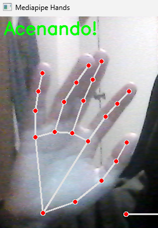

# Detecção de Mãos Acenando com MediaPipe
Este projeto usa MediaPipe e OpenCV para detectar quando uma mão está acenando, utilizando a webcam do computador.


## Instalação
1.Clone o repositório:

```bash
git clone https://github.com/seu-usuario/seu-repositorio.git
cd seu-repositorio
```

2.Crie um ambiente virtual:

```bash
python -m venv env
```

3.Ative o ambiente virtual:

No Windows:
```bash
Copiar código
env\Scripts\activate
```

No macOS/Linux:
```bash
Copiar código
source env/bin/activate
```

4.Instale as dependências:
```bash
Copiar código
pip install mediapipe==0.10.0 opencv-python==4.7.0.72
```

## Uso
Execute o script principal:

```bash
python main.py
```

 - Levante a mão na frente da câmera e acene.
 - A mensagem "Acenando!" será exibida quando a mão for detectada acenando.
 - Pressione "Esc" para sair.

## Descrição

### OpenCV (cv2)
O OpenCV é uma biblioteca de visão computacional que permite:

 - Processamento de imagens e vídeos.
 - Aplicação de filtros.
 - Detecção de objetos, rostos e outros elementos em imagens.
 - Manipulação de fluxos de vídeo em tempo real.

### MediaPipe
O MediaPipe é uma biblioteca de machine learning que oferece soluções de:

 - Detecção de mãos, rostos e poses corporais.
 - Rastreamento de objetos.
 - Reconhecimento de gestos.
 - Implementação fácil em tempo real para projetos de visão computacional.

## Como Funciona
O script:

1. Captura o vídeo da webcam.
2. Utiliza o MediaPipe para detectar posições da mão e do corpo.
3. Identifica se a mão está acenando com base em:
    - Posição do pulso em relação ao ombro.
    - Estabilidade do pulso.
    - Movimento do pulso em relação ao pescoço.

## Contribuições
Contribuições são bem-vindas! Sinta-se à vontade para abrir issues ou enviar pull requests.